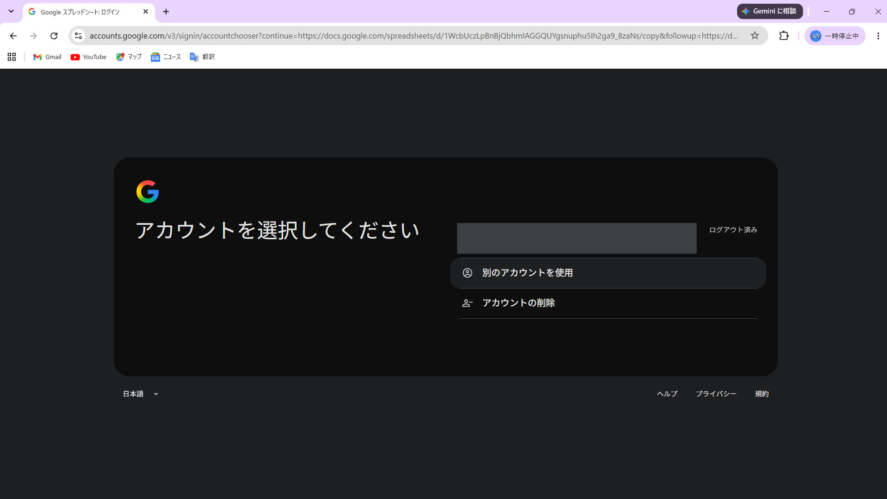
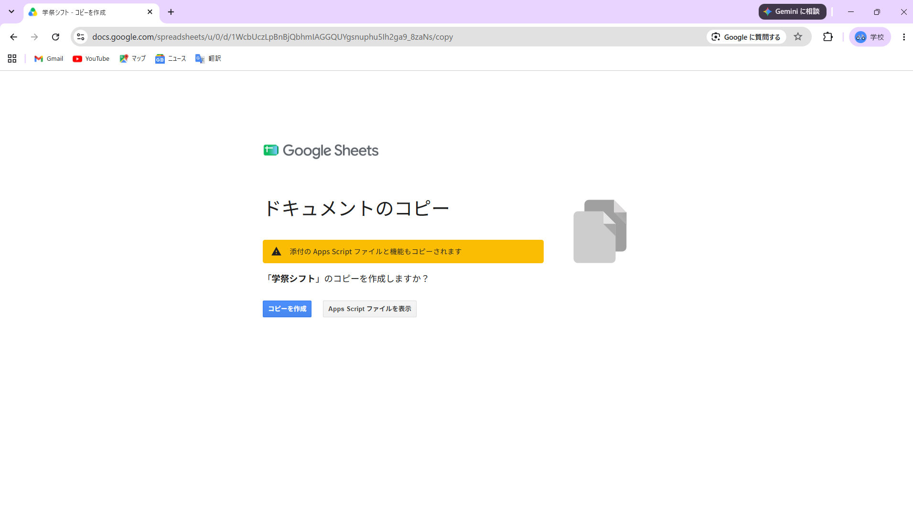
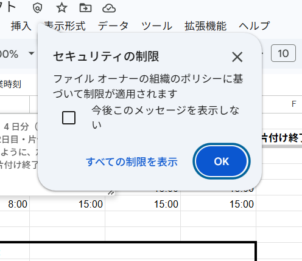
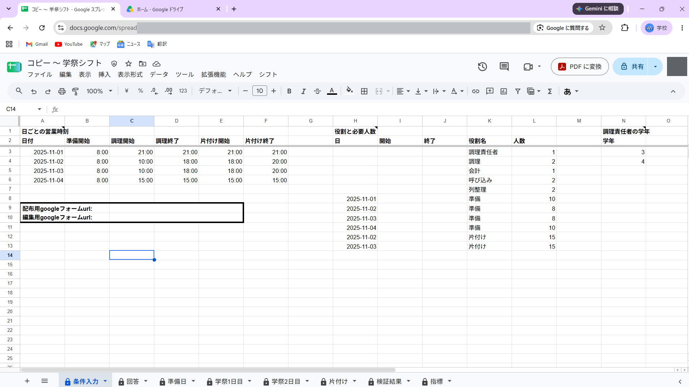
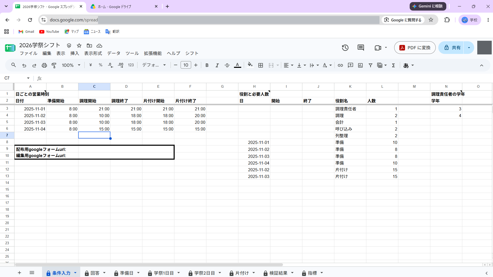

**開発する方は [Contributing](CONTRIBUTING.md) を参照してください。** 以下は、シフトを作る担当者のための引き継ぎ手順書です。

# 学祭シフトの引き継ぎ手順

**ここにあるのは、今年シフトを作る担当者が、自分のドライブに今年のファイルを用意するまでの手順である。**
**前提知識は要らない。** 上から順に読めばよい。

> **ひな形である**（→ [#261](https://github.com/jun-eg/school-festival-shift/issues/261)）。
> 見出しと各節の役割だけを置いた。**手順の文面は [#260](https://github.com/jun-eg/school-festival-shift/issues/260) の残りの項目で埋める。**

## 本線 — `/copy` リンクからコピーする

**ふつうはこちらを使う。** 下の 3 つを、この順で踏む。

### 1. テンプレートファイルをコピーする

**[こちら](https://docs.google.com/spreadsheets/d/1WcbUczLpBnBjQbhmIAGGQUYgsnuphu5Ih2ga9_8zaNs/copy) から Google スプレッドシートをコピーします。**
コピーはご自身の Google ドライブに保存されるため、お手数ですが Google へのログインをお願いします。

1. **アカウントを選択します。** 個人・大学のどちらのアカウントでも構いません。使い慣れている方を選んでください。

   

2. **「コピーを作成」を押します。** 「添付の Apps Script ファイルと機能もコピーされます」と出ますが、そのまま進めて構いません。

   

3. **「セキュリティの制限」が出たら「OK」を押します。**

   

4. **画面左上のタイトル（「コピー 〜 学祭シフト」）を押し、好きなファイル名に変えます。**

   

5. **タイトルが変われば、テンプレートファイルのコピーは完了です。**

   

### 2. メニュー「シフト」が出るのを待つ

<!-- 役割: 開いたコピーにメニューが出るまで待つこと。出ないときは開き直す -->

### 3. フォームを作る・承認する

<!-- 役割: シフト → フォームを作る。初回だけ出る承認の画面の通し方（スコープは全部にチェック） -->

## 予備 — 前年の担当者に「来年用に空にする」をしてもらう

**このページが開けないとき、または上の `/copy` リンクが切れているときだけ使う。**

<!-- 役割: 前年の担当者に頼むこと（コピー → シフト → 来年用に空にする → 複製されたフォームをゴミ箱へ → 渡す）と、受け取った後は本線の 2 から同じであること -->
