**開発する方は [Contributing](CONTRIBUTING.md) を参照してください。** 以下は、シフトを作る担当者のための引き継ぎ手順書です。

# 学祭シフトの引き継ぎ手順

**学祭の出店のシフト表を、Google スプレッドシートの上で自動で作る仕組みです。**
白紙から割り当てを組む代わりに、自動で作った仮のシフト表に手を入れるだけで済みます。

1. テンプレートをコピーし、日付や役割ごとの必要人数などの条件を入れる
2. メニューからシフト希望を集める Google フォームを自動で作り、サークルに配る
3. 集まった回答と条件をもとに、準備日・学祭 1 日目・学祭 2 日目・片付けのシフト表を自動で作る
4. シフト表を手直しすると、条件を満たしているかが自動で検証し直される
5. 日ごとのシフト表を画像で書き出し、サークルに共有する

## 1. テンプレートファイルをコピーする

**[こちら](https://docs.google.com/spreadsheets/d/1Kjm7onXdozT-Khz9WUxTFoWGvI9Z0_ogmuieHPdY-lY/copy) から Google スプレッドシートをコピーします。**
コピーはご自身の Google ドライブに保存されるため、お手数ですが Google へのログインをお願いします。

### 1. アカウントを選択します

個人・大学のどちらのアカウントでも構いません。使い慣れている方を選んでください。

### 2. 「コピーを作成」を押します

「添付の Apps Script ファイルと機能もコピーされます」と出ますが、そのまま進めて構いません。

### 3. 「セキュリティの制限」が出たら「OK」を押します

### 4. ファイル名を変えます

画面左上のタイトル（「コピー 〜 学祭シフト」）を押し、好きなファイル名に変えます。

### 5. タイトルが変われば、コピーは完了です

## 2. 条件を入力する

**「条件入力」シートに入れた条件をもとに、シフトを作ります。**
**太字**の項目以外は、基本的に初期値のままで構いません。

### 1. 日付と時刻を今年の予定に合わせます

**学祭の日付**と、**準備開始**・**調理開始**・**調理終了**・**片付け開始**・**片付け終了**の時刻を変えます。初期値と同じ形で入力してください。

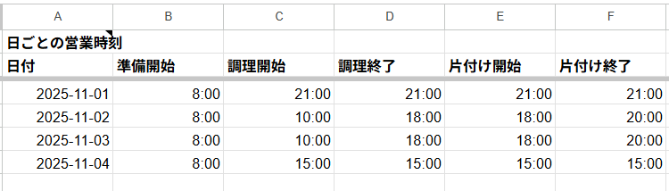

### 2. 役割ごとの必要人数を決めます

**準備**と**片付け**は、日ごとに人数を決められます。

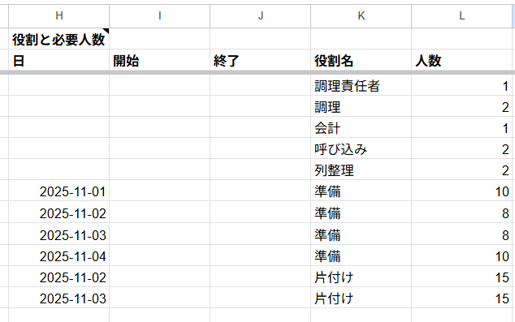

### 3. 調理責任者になれる学年を決めます

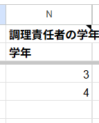

### 4. 委員会の指定枠を入れます

**委員会の指定枠**（例: クリーンパトロール）を入れます。

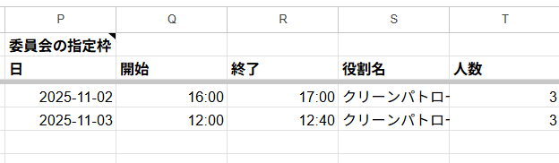

### 5. 午前と午後の境界の時刻を決めます

準備に入っているのに午前の役割が無い、といった割り当てを避けるために使います。

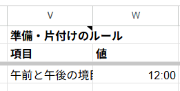

### 6. シフト 1 回ぶんの最小時間を決めます

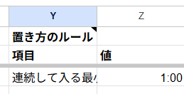

### 7. 9〜10 行目は空のままにします

次の「3. フォームを作る」でフォームを作ると、ここに URL が自動で入ります。**これで条件の入力は完了です。**

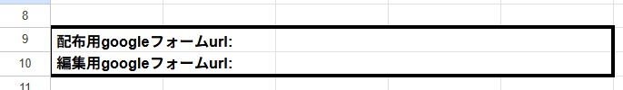

## 3. フォームを作る

### 1. 画面上部のメニューの「シフト」を押します

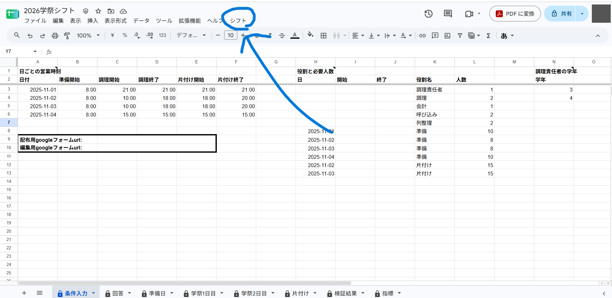

### 2. 「フォームを作る」を押します

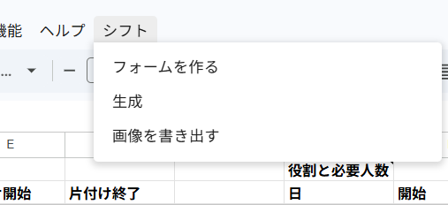

### 3. 「認証が必要です」と出たら「OK」を押します

初めてのときだけ出ます。

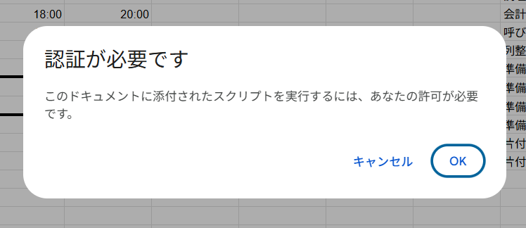

### 4. 「このアプリは Google で確認されていません」と出たら、左下の「詳細」を押します

出ない場合もあります。出なければ 6 に進んでください。

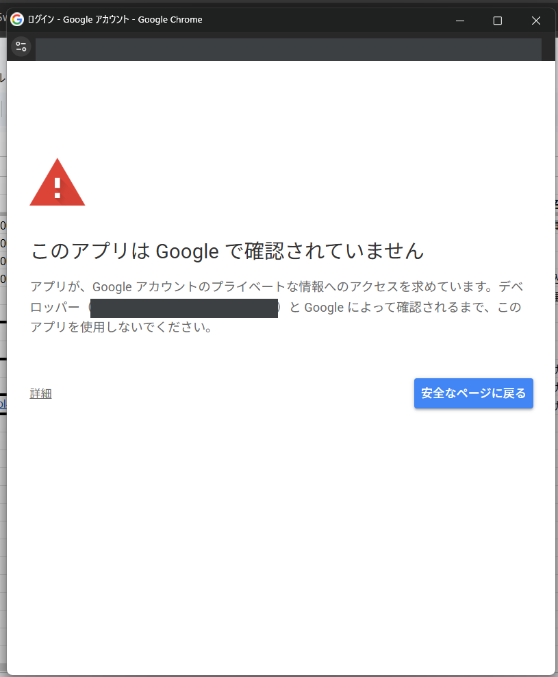

### 5. 左下の「学祭シフト（安全ではないページ）に移動」を押します

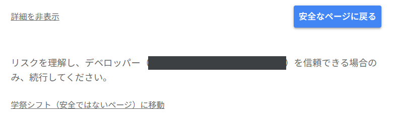

### 6. 「すべて選択」にチェックを入れ、「続行」を押します

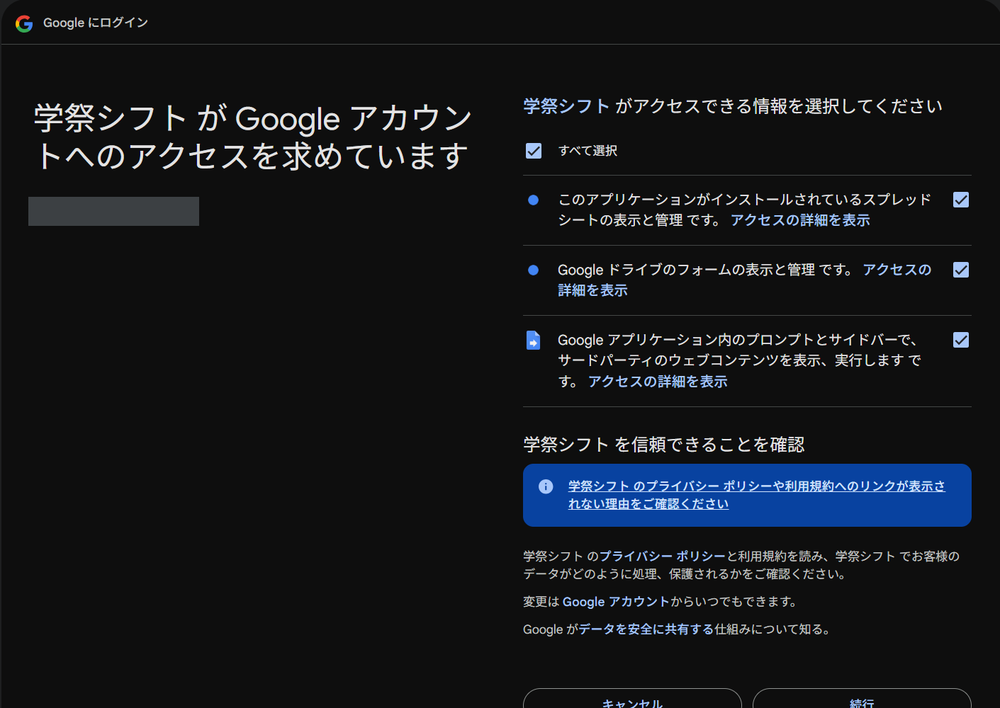

### 7. 調理名簿の画像を選び、「フォームを作る」を押します

作り終わるまで 30 秒〜1 分ほどかかります。

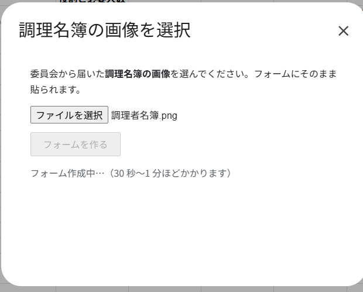

### 8. 「フォーム作成が完了しました！！」と出れば、フォームの作成は完了です

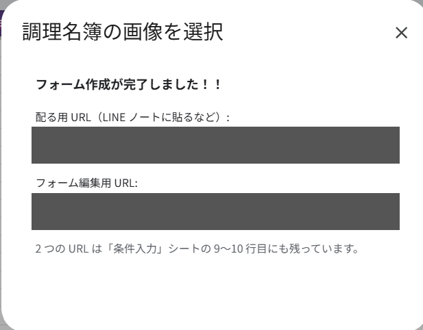

### 9. 配布用の URL を、サークルに共有します

LINE グループのノートなどに貼ってください。URL は「条件入力」シートの 9 行目にも自動で入っています。

## 4. シフト表を作る

**フォームの回答は、「回答」シートに自動で集まります。**

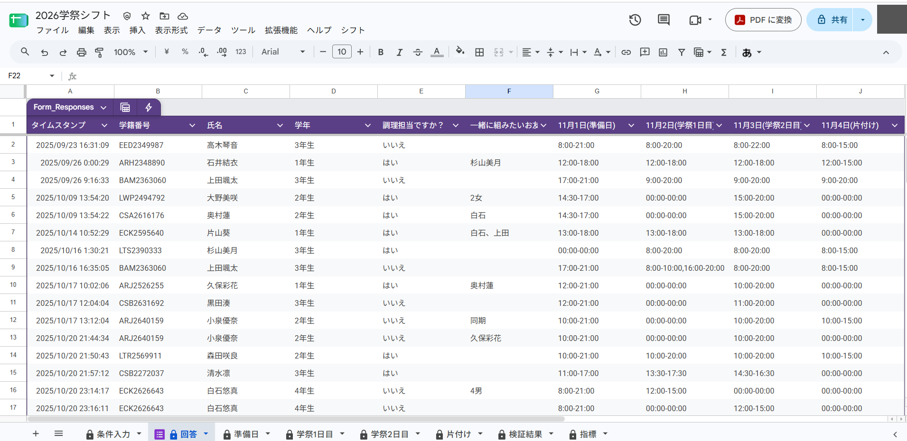

### 1. 画面上部のメニューの「シフト」を押します

### 2. 「生成」を押します

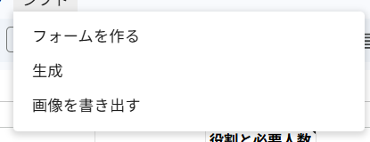

### 3. 画面右下に「シフトを作成しました」と出れば、シフト表の作成は完了です

「準備日」「学祭1日目」「学祭2日目」「片付け」の各シートに、おおまかなシフト表ができています。

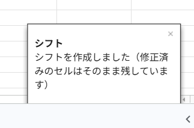

## 5. シフト表を手直しする

**自動で作ったシフト表は、どうしても手直しが必要になります。**
たとえば、自動生成は仲の良い友達どうしの組み合わせを考えていません。余裕があれば調整してみてください。

### 1. 「検証結果」シートを見ます

「検証結果」シートには、「条件入力」シートで決めた条件（役割ごとの必要人数など）を満たせなかった枠が並びます。
準備・片付け以外の枠は優先して埋める必要があるので、**黄色**で表示されます。
「候補」列には、その枠に入れられる人の名前が出ます。埋めるときの参考にしてください。

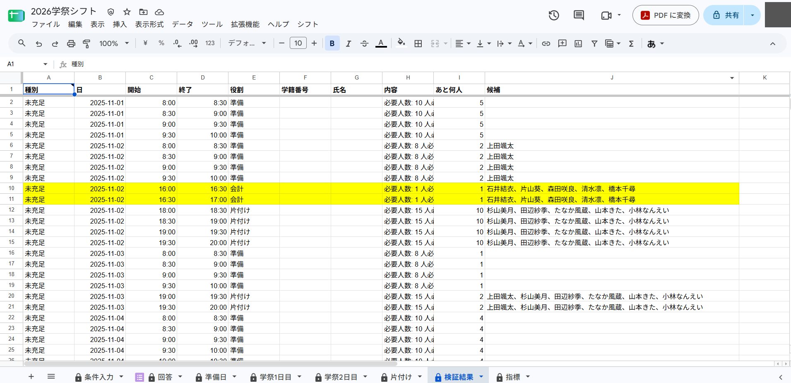

### 2. 役割を書き込む・消す

シフト表のセルに役割名を書き込むと、6〜8 秒後に自動で背景色が付き、検証がやり直されて「検証結果」シートが更新されます。
逆に役割名を消すと、同じく自動で背景色が消え、検証がやり直されます。

例: 「列整理」を割り当てる場合

1. 役割名を入力します。

   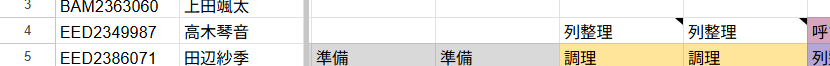

2. 6〜8 秒後、自動で背景色が付き、検証がやり直されます。

   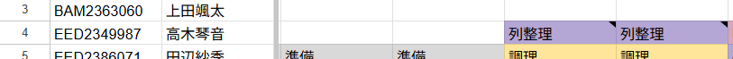

3. 画面右下に検証の結果が出ます。「検証結果」シートも更新されています。

   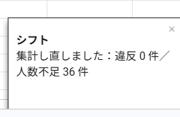

### 3. 人を追加する

シフト表に人を追加するときは、氏名のセルの選択肢から選びます。5 秒ほどで学籍番号が自動で入ります。

1. 氏名のセルの選択肢から、追加する人を選びます。

   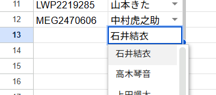

2. 5 秒ほどで、学籍番号が自動で入ります。

   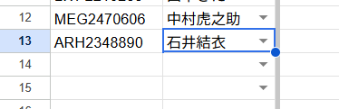

3. その後、役割を書き込んでください。

※ 選択肢に出るのは、シフト希望を出した方だけです。選択肢にいない方を追加するときは、手入力でお願いします。

### 4. 違反を確認する

希望時間外に割り当ててしまうと、そのセルの役割名が**赤い太字**になります。違反の内容は「検証結果」シートで確認できます。

例: 希望時間外に誤って割り当てた場合

1. 6〜8 秒後、自動で背景色が付き、検証がやり直されます。違反したセルは赤い太字になります。

   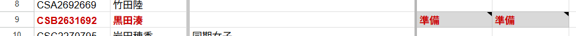

2. 画面右下に、違反の件数が出ます。

   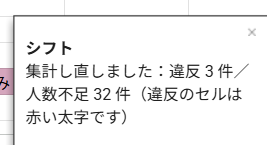

3. 「検証結果」シートで、違反の内容を確認できます。

   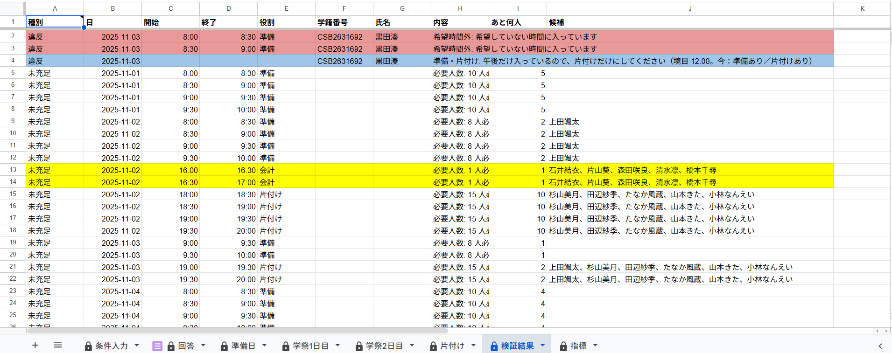

**赤**は必ず直す違反、**青**は公平さを欠くものの、そのままでも問題のない違反です。

## 6. シフト表を画像で書き出す

### 1. 画面上部のメニューの「シフト」から、「画像を書き出す」を押します

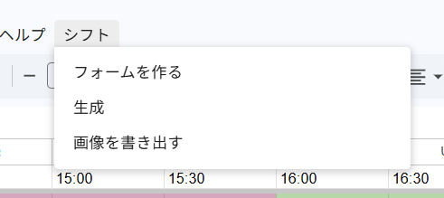

### 2. 「4 枚まとめて保存」を押します

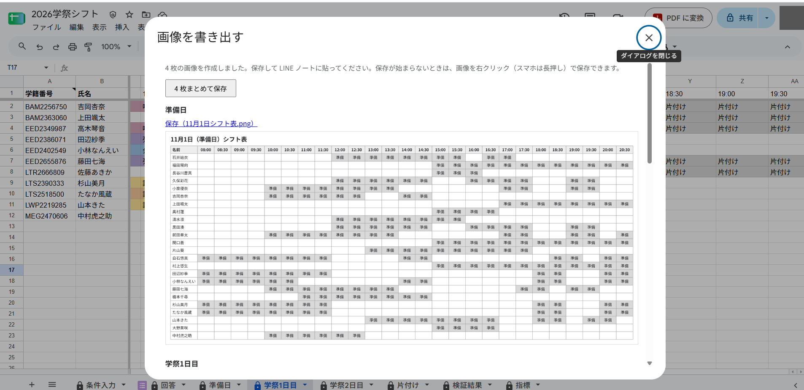

日ごとのシフト表の画像が、ご自身の PC にダウンロードされます。

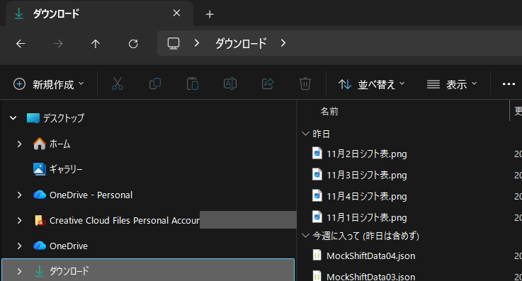

### 3. シフト表の画像を、サークルに共有します

LINE グループのノートなどに貼ってください。

**これでシフトの作成は完了です。おつかれさまでした！**

## 次の担当者に引き継ぐ

LINE などで、このページの URL（<https://github.com/jun-eg/school-festival-shift>）を渡してください。
